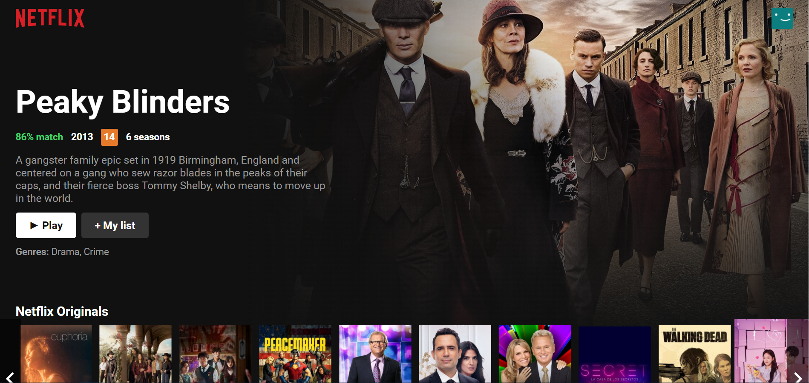
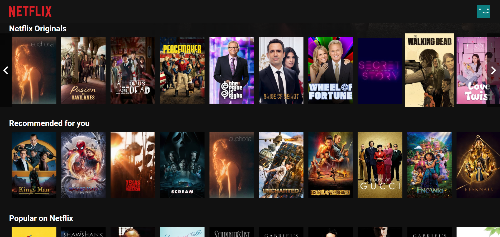

# Netflix Clone

## Description

This project is a simplified Netflix home page for my portfolio ([live demo here](https://johnatancarvalho.github.io/netflix-clone/)). It features a mobile-friendly web app that fetches movie data from [themoviedb.org API](https://www.themoviedb.org/documentation/api).

#### _Displays a featured movie or TV show._

#### _And other relevant movie lists with navigation scroll for left and right._

## Setup/Installation Requirements

- Install [Node.js](https://nodejs.org/)
- Download or clone this repo
- Open terminal and navigate to the repo's main folder
- Run `npm install`
- Register at [themoviedb.org](https://www.themoviedb.org/) and follow the [instructions](https://developers.themoviedb.org/3/getting-started/introduction) to apply for an API key
- Create a `.env` file and add a environment variable named `REACT_APP_TMDB_API_KEY=ABC123`. Replace "ABC123" with your actual API key.
- Run `npm start`

## Technologies Used

&nbsp;
&nbsp;
&nbsp;
&nbsp;

## Contact Details

